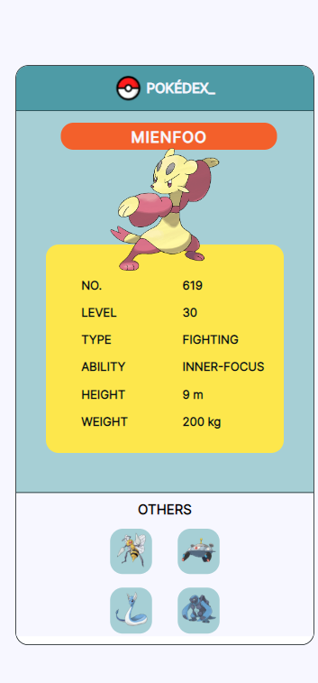
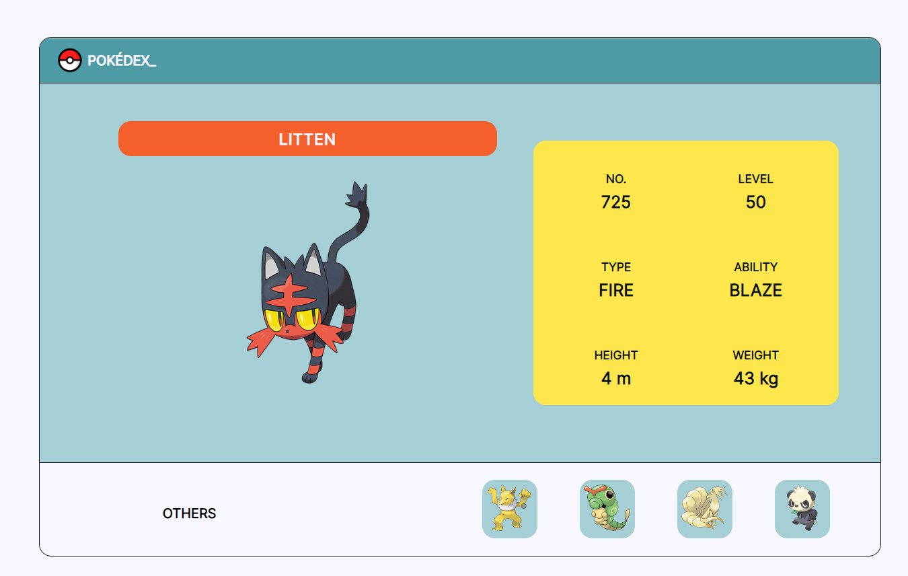

# POKÉDEX

Using  [Pokeapi](https://pokeapi.co/),  a responsive web interface is built that is based on the Pokedex.


[Go to Project clicking here](https://pokedex-lac-kappa.vercel.app/)

### Mobile View
<p align="center">

</p>  

### Desktop View
<p align="center">

</p>  


## Installation

Clone the repo and run `yarn install`

## Start

After the successfully installation of the packages:
If you want to start dev environment:  
```
yarn dev
```
If you want to see it in prod environment:  
```
yarn build
yarn serve
```
